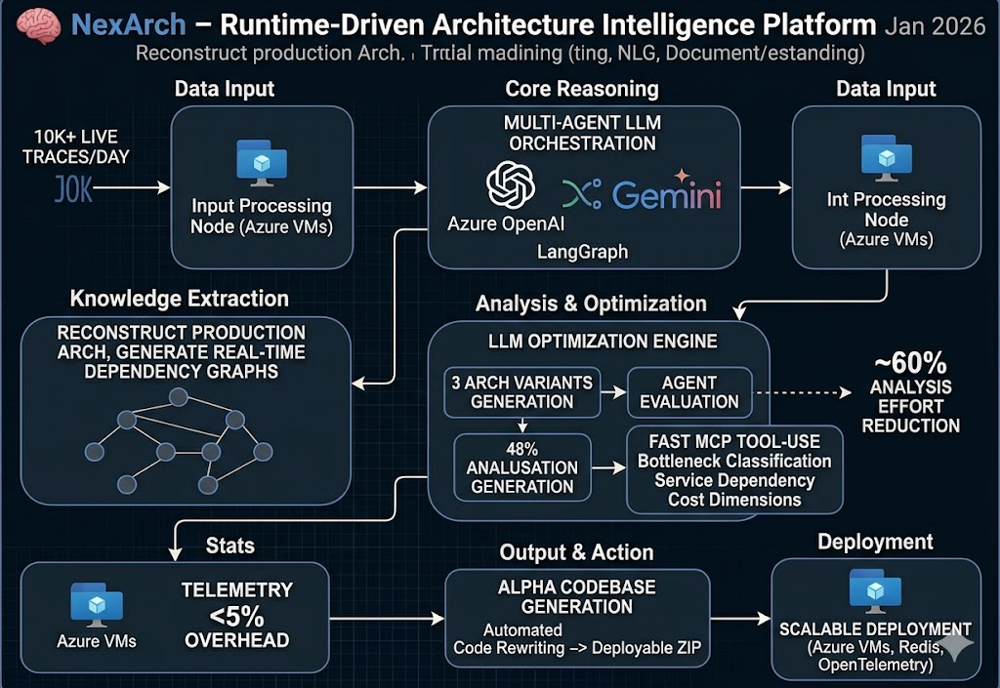

# Hey, I'm Jagdish 👋 
### Machine Learning Engineer & AI Engineer

hy , jay this side ...
i am a cs engineer focusing on 2 categories : 
1 one is like as of most people  - learning to get a job - for  the roles : 
- Data /Business Analyst - as from early childhood i if i do something so there should be  a effect of my each activity  and same here i the tech world ..
- ML engineer - as am consistent in practicing on kaggle and like a routine task and love doing predictions from early age and  converging that through ml ... love it ..

- other  one - i like to build [roduct that actually ease the life .. ease our daily task whether how small are they .. if they r helping us genuinely ..i love to work on those product .
- 
I build end-to-end AI applications, my focus lies in extracting actionable business insights through data analytics, optimizing predictive models, and architecting production-grade AI agents to solve complex problems.
  Also to scale the product from the reasearch to production .
---
### 📊 GitHub Stats & Analytics

  

 

  

---

### 🐍 Contribution Activity

  <picture>
    <source media="(prefers-color-scheme: dark)" srcset="dist/github-contribution-grid-snake-dark.svg?palette=github-dark">
    <source media="(prefers-color-scheme: light)" srcset="dist/github-contribution-grid-snake.svg">
    
  </picture>

---

## 🚀 Hackathon & Engineering Track Record

- **1st Runner-Up** | *IIT Roorkee — Merge Conflict Hackathon (44-Hour)* — Selected from 114 finalist projects after building data-driven systems under intense competition conditions with Team ArcticX.
- **2nd Runner Up & Community Choice Award** | *Watch The CODE Hackathon (GEHU Haldwani)* — Secured a top podium finish and won the vote of all fellow competing teams for Best Project with *CogniSafe* (competing solo as Team BackupPlan).
- **2nd Runner-Up** | *AI Innovation Challenge (MIET Kumaun)* — Designed, trained, and pitched localized innovative AI solutions.
@@ -13,12 +15,13 @@ I build end-to-end AI applications, optimize predictive models, and design intel
---

## 🛠️ Core Skills & Domain Expertise

### 🧠 AI, NLP & Machine Learning
- *Modeling & Fine-Tuning:* Model Training & Fine-tuning, Evaluation Frameworks, Semantic Modeling, Natural Language Query Parsing, Document Understanding, Metric Extraction.
- *Architectures:* Generative Adversarial Networks (GANs), Convolutional Neural Networks (CNNs), Retrieval-Augmented Generation (RAG) Pipelines, Advanced Prompt Engineering, Multi-Agent Coordination.
- *Frameworks & Tools:* PyTorch, Scikit-learn, Pandas, NumPy, XGBoost, LightGBM, CatBoost, Optuna (Model Evaluation & Optimization).

### ⚙️ Agentic AI, Automation & Core Engineering
- *Orchestration & Agents:* LangGraph, LangChain, FastMCP (Model Context Protocol), Tool-Augmented Agents.
- *Automation & Pipelines:* Selenium, Multi-threaded Web Scraping, Real-time Data Pipelines.
- *Backend & Infra:* Node.js, React, Vite, Next.js, FastAPI, WebSockets, Redis, OpenTelemetry (Observability), Azure VMs.
@@ -27,31 +30,29 @@ I build end-to-end AI applications, optimize predictive models, and design intel

## 🌟 Production-Grade Featured Projects

> *Demo* | *Live Project* | *GitHub* &nbsp;·&nbsp; *Jan 2026*
>
> `Python` `LangGraph` `LangChain` `FastAPI` `Azure-OpenAI` `Gemini` `FastMCP` `Redis` `OpenTelemetry` `Next.js` `WebSockets` `Azure-VMs`

- **Multi-Agent LLM Orchestration:** Built a LangGraph-powered agent system using Azure OpenAI & Gemini to reason over 10K+ live microservice traces/day, reconstructing production architectures and generating real-time dependency graphs without source-code access.
- **Prompt Engineering & Tool-Augmented Agents:** Designed structured prompts and tool-use schemas via FastMCP for LLM agents to perform bottleneck classification, service dependency inference, and architecture comparison across latency, scalability, and cloud cost dimensions.
- **LLM Optimization Engine:** Implemented a pipeline generating 3 architecture variants per workflow; agents evaluate trade-offs and recommend the best variant, reducing manual system analysis effort by ~60%.
- **Production Observability via OpenTelemetry:** Developed a lightweight Python SDK capturing telemetry with <5% runtime overhead, integrated across distributed services for real-time signal collection.
- **Alpha Codebase Generation:** Automated code rewriting against the selected architecture variant, packaging output as a deployable ZIP—closing the loop from insight to implementation.
- **Scalable Deployment:** Deployed backend architecture on Azure VMs; async graph-based reasoning pipelines reduced architecture inference latency by ~60%.

---

### 🛡️ [Pindora_shield](https://github.com/gitbyjay25/Pindora_shield) — AI Drug Discovery Framework
> *GitHub* &nbsp;·&nbsp; *Dec 2025 – Jan 2026*
>
> `Python` `PyTorch` `GANs` `TenGAN` `SMILES` `FastAPI` `React` `Vite` `Azure-VM`
- **High-Throughput Molecule Generation:** Built a scalable AI drug discovery platform evaluating 10K+ molecules per run via GANs and multi-model ML pipelines, reducing candidate screening time by >90%.
- **Generative Pipeline:** Implemented a TenGAN-based molecular generation pipeline producing 10,000+ chemically valid SMILES per query, providing 8–10x coverage vs baseline retrieval.
- **Multi-Model Evaluation Logic:** Trained 5 independent predictive ML models (IC50, target association, clinical phase, drug-likeness); built model evaluation logic to assess prediction confidence and filter low-reliability candidates—directly analogous to evaluating LLM outputs for accuracy and hallucination risk.
- **REST Orchestration:** Automated an end-to-end 6-stage pipeline (disease input → target mapping → molecule generation → multi-model property prediction → filtering → ranking) via FastAPI.
- **Fault-Tolerant Infrastructure:** Engineered failure-safe execution logic preventing invalid inputs, model crashes, and partial pipeline failures in high-volume batch inference settings.
